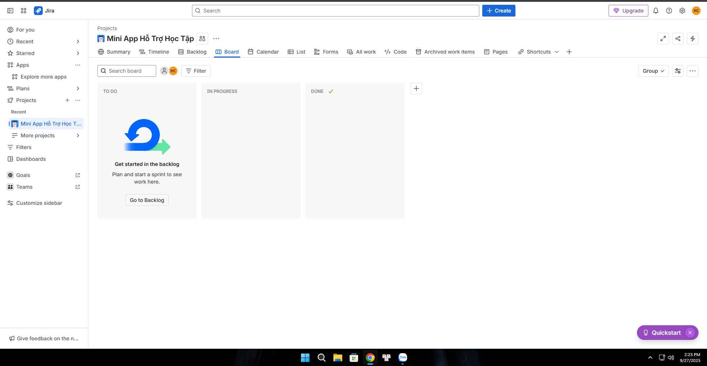
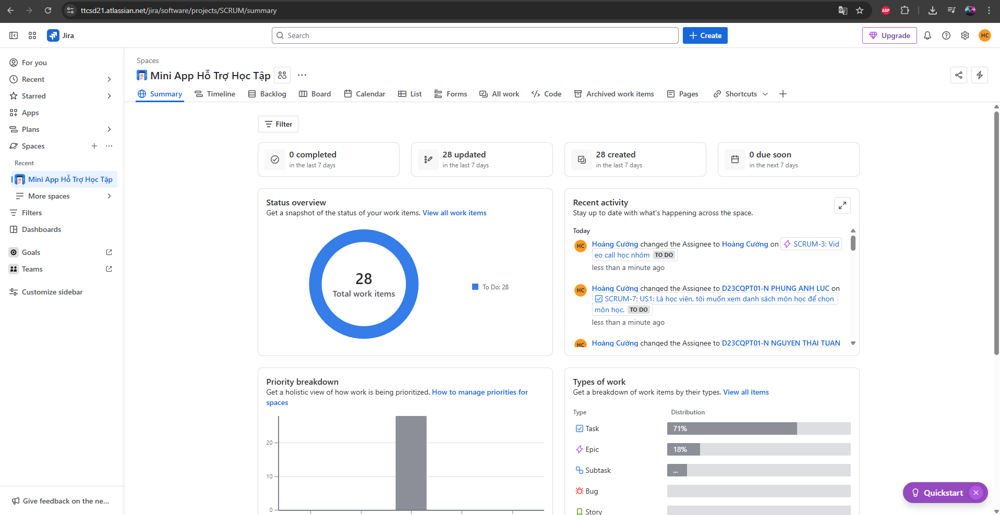
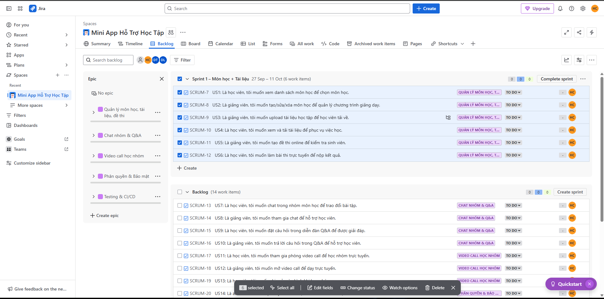
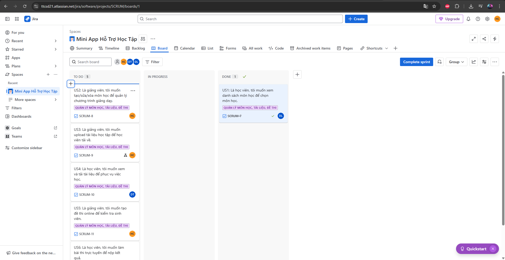
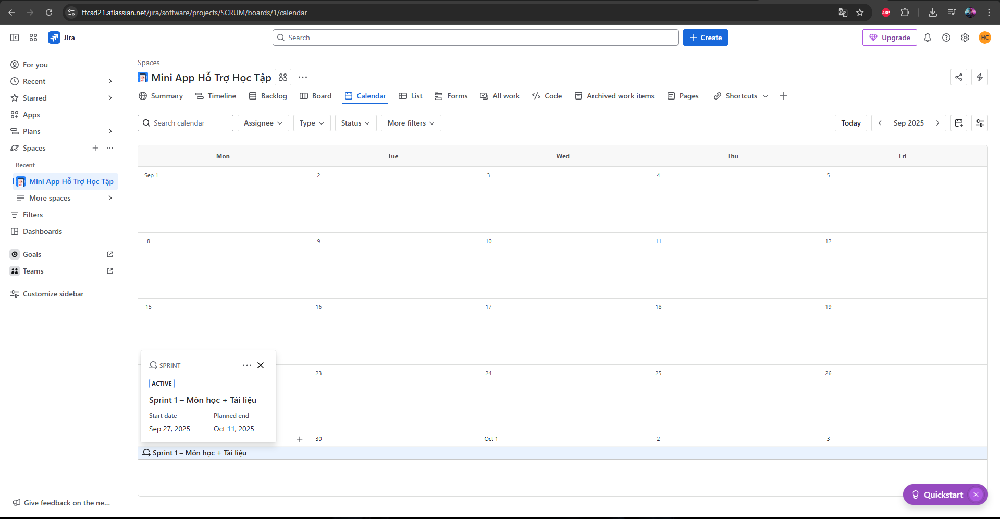
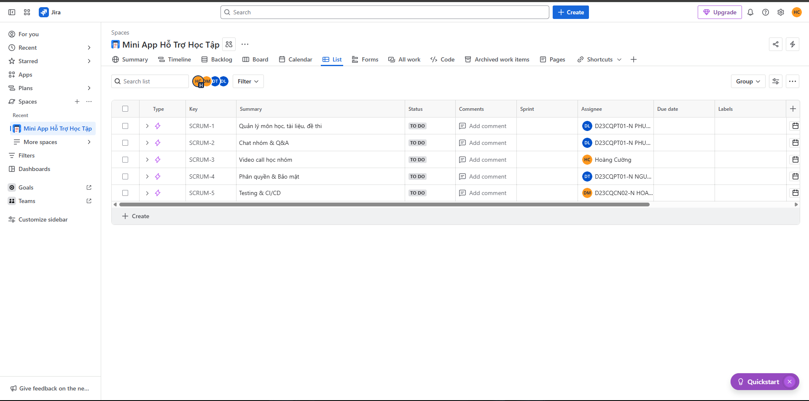
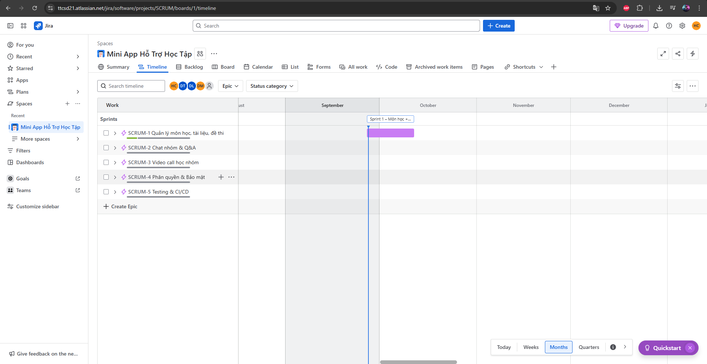

# 📌 Lab 09 – Quản lý dự án ATM / Mini App Hỗ Trợ Học Tập trên Jira

## 📝 Mục tiêu
Mô phỏng quản lý phát triển hệ thống *Mini App Hỗ Trợ Học Tập & Thi Trực Tuyến* bằng phương pháp **Agile Scrum** sử dụng **Jira Cloud**.

Bao gồm các bước:
- Tạo Project Jira
- Xây dựng Backlog (Epic, User Story, Task)
- Lập Sprint 1 (2 tuần)
- Quản lý công việc bằng Board
- Theo dõi bằng Burndown Chart và Calendar
- Báo cáo Sprint

## 📂 Evidence Jira Screenshots

### 1. Tạo Project và Board trống

### 2. Dashboard / Summary của Project

### 3. Backlog với Epic & Sprint 1
- Epic: Quản lý môn học, tài liệu, đề thi
- Sprint 1: chứa US1–US6 (môn học, tài liệu, đề thi, làm bài thi)

### 4. Sprint Board (Kanban View)
- To Do: US2, US3, US4…
- In Progress: các task đang được thực hiện
- Done: US1 đã hoàn thành

### 5. Sprint Calendar (thời gian chạy Sprint)
- Sprint 1: 27/09 – 11/10

### 6. Danh sách công việc (List View)
- Hiển thị theo type: Epic, Story, Task

### 7. Timeline / Roadmap
- Thể hiện Sprint 1 nằm trong tháng 9–10

### Kết luận
- Backlog đã được xây dựng với đầy đủ **Epic, User Story, Task**.  
- Sprint 1 đã được khởi tạo và quản lý bằng **Board**.  
- Có theo dõi tiến độ bằng **Calendar** và **Timeline**.  
- Ảnh chụp đầy đủ để làm minh chứng nộp báo cáo.

